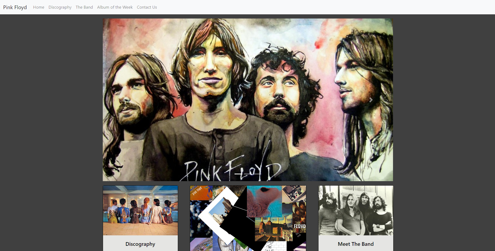

# Pink Floyd Fan Page
A practice website to help hone what I have been learning in my bootcamp

## Site URL
https://nick-hernstedt.github.io/PinkFloyd/
## What it is
This is a pink floyd fan page. It does the following:
- provides the user with album information
- has ways to play music from your chosen album
- provides detailed information about the album of the week
##

## Upcoming features
- meet the band page

## Technologies
- HTML
- CSS 
- Bootstrap 4

## User story
AS A person who likes Pink Floyd,
I WANT to find an fun website that will provide me information about the band,
SO THAT I can learn interesting info about the band.

GIVEN a website about pink floyd,

WHEN I click the discography area,
THEN I am shown shown pink floyd records.

WHEN I click on the records button,
THEN I am shown albumn info and a way to play the music.

WHEN I click album of the week,
THEN I am taken to a page that gives me information about said album.

Meet the band page under construction
